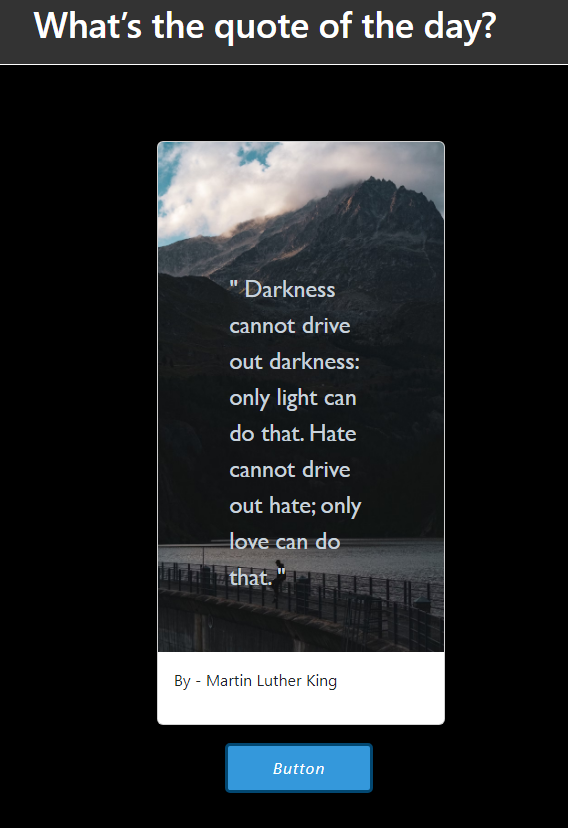

# Random Quote Generator Web App

![App Screenshot]<video src="20230825-1719-26.8866593.mp4" controls title="Instruction"></video>
Welcome to the Random Message Generator web application!
This is a simple project built to demonstrate the generation of random messages
every time a user clicks a button. It's a fun way to display different messages and add
an interactive element to your website.


## Features

- Generates random messages on button click.
- Provides an interactive and engaging user experience.
- Lightweight and easy to integrate into any website.

## Getting Started

These instructions will help you set up and run the project on your local machine for development and testing purposes.

### Prerequisites

- Web browser (Chrome, Firefox, Safari, etc.)

### Installation

1. Clone the repository:

   ```bash
   git clone https://git@github.com:NeamenD/What-is-the-quote-of-the-day.git
   ```

1. Navigate to the project directory:

   bash
   Copy code
   cd folder

1. Open index.html in your web browser:

   Simply double-click on the index.html file to open it in your default web browser.

### Usage

1. Open the web page in your browser.

2. Click the "Generate Message" button.

3. Watch as the app displays a new random message each time you click the button.

### Contributing

Contributions are welcome! If you find any issues or have ideas for improvements, feel free to submit a pull request.

### License

This project is licensed under the MIT License - see the LICENSE file for details.

### Acknowledgments

- This project was inspired by the idea of creating simple, interactive web apps.
- Thanks.
